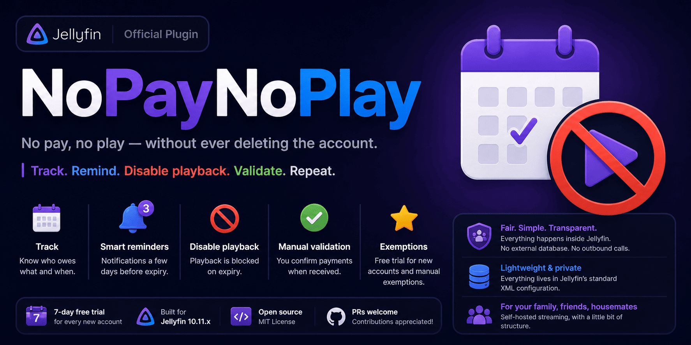

<div align="center">



# 💳 NoPayNoPlay

**Jellyfin plugin for tracking manually-validated monthly subscriptions.**

*No pay, no play — without ever deleting the account.*

[](https://github.com/alexisometric/nopaynoplay/stargazers)
[](https://github.com/alexisometric/nopaynoplay/releases)
[](https://github.com/alexisometric/nopaynoplay/actions/workflows/ci.yml)
[](https://github.com/alexisometric/nopaynoplay/releases/latest)
[](https://jellyfin.org)
[](https://github.com/lscambo13/ElegantFin)
[](LICENSE)
[](docs/DEVELOPMENT.md)

<a href="https://ko-fi.com/alexisometric">
  
</a>

</div>

<!-- Screenshots à ajouter ici -->

---

## 📋 Table of Contents

- [What is it for?](#-what-is-it-for)
- [Installation](#-installation)
- [Quick start](#-quick-start)
- [Features](#-features)
- [How it works](#-how-it-works)
- [User guide](#-user-guide)
- [REST API](#-rest-api)
- [Localization](#-localization)
- [Development](#-development)
- [Documentation](#-documentation)
- [FAQ](#-faq)

---

## ✨ What is it for?

You self-host Jellyfin for your family / friends / housemates and you'd like them to chip in for the bills — without plugging in Stripe, opening a company and spending Friday nights chasing payments on WhatsApp.

**NoPayNoPlay** automates the tedious parts:

| What it does | How |
|---|---|
| 📅 **Tracks subscriptions** | Automatically assigns a free trial on first sign-in and tracks expiry dates |
| 🔔 **Reminds users** | Sends Jellyfin bell notifications at J-3, J-1, J0, and when grace expires |
| 🚫 **Blocks playback** | Disables playback on expiry — **without deleting the account** |
| ✅ **Manual payment validation** | You check PayPal/Lydia, then click "Record payment" in the admin panel |
| 🙋 **Self-service** | Users click **"I just paid"** — admins get a pending badge to confirm or reject |
| 🎁 **Promo / referral codes** | Grant free months via shareable codes with configurable limits and expiry |
| 🆓 **Free trial** | Configurable trial days (default: 7) on every new account |
| 🛡️ **Exemption** | Manual exemption for family, VIPs, or admins (admins are always exempt) |

> **No external database. No outbound calls. No Stripe. No subscription to manage.**
>
> Everything lives in Jellyfin's standard XML configuration — simple, transparent, reversible.

---

### 🎬 Quick demo

---

## 📦 Installation

### Prerequisites

| Requirement | Details |
|---|---|
| **Jellyfin** | Version 10.11.x or compatible |
| **File Transformation** *(recommended)* | Required for the user UI (banner, modal, header button) — [install from GitHub](https://github.com/IAmParadox27/jellyfin-plugin-file-transformation) |

### Recommended: via repository

**Dashboard → Plugins → Repositories → ➕**

| Field | Value |
|---|---|
| **Repository Name** | `NoPayNoPlay` |
| **Repository URL** | `https://raw.githubusercontent.com/alexisometric/nopaynoplay/main/manifest.json` |

Then go to **Catalog → NoPayNoPlay → Install**, restart Jellyfin, and install the [File Transformation](https://github.com/IAmParadox27/jellyfin-plugin-file-transformation) companion plugin.

### Alternative: manual ZIP

1. Download the latest release ZIP from the [releases page](https://github.com/alexisometric/nopaynoplay/releases)
2. Extract to Jellyfin's `plugins/` directory
3. Restart Jellyfin

> 📖 **Full installation guide → [docs/INSTALL.md](docs/INSTALL.md)**

---

## 🚀 Quick start

After installing and restarting Jellyfin:

1. Go to **Dashboard → Plugins → NoPayNoPlay**
2. Set your **monthly price** and **currency**
3. Add your **PayPal.me** and/or **Lydia** links
4. Configure **grace days**, **trial days**, and **warning window** to your preference
5. Click **Save**
6. *(Optional)* Go to the **Tiers** tab to create subscription packages
7. *(Optional)* Go to the **Tags** tab to create member groups with custom pricing

> ⚠️ The user UI (💳 button, banner, modal) requires the **File Transformation** plugin. Without it, only the server-side features (enforcement, notifications, admin dashboard) work.

> 📖 **Full configuration reference → [docs/CONFIGURATION.md](docs/CONFIGURATION.md)**

---

## 🚀 Features

### 👤 For admins

| Feature | Description |
|---|---|
| **Members dashboard** | Color-coded member list with search, filters, sort, and pagination |
| **Revenue stats** | Monthly revenue + 12-month inline SVG bar chart |
| **Record payments** | One-click payment recording with transaction history (edit/delete) |
| **Pending claims** | Badge when a user says "I just paid" — confirm or reject in one click |
| **Bulk actions** | Select multiple users to pay, exempt, reset, or notify in batch |
| **Promo codes** | Create codes with configurable months, max uses, and expiry |
| **Subscription tiers** | Define packages (1/3/6/12 months) with automatic savings display |
| **Member tags** | Group members with per-tag price overrides |
| **Activity log** | Transaction history with date range filters and CSV export |
| **Audit log** | Last 500 admin actions recorded with timestamp and details |
| **Notifications** | Automated bell notifications at configurable milestones |
| **Exemption** | Mark users as exempt (never blocked) |
| **Auto-backup** | Configuration backed up automatically on every save (retention: 10) |
| **Skeleton loading** | Animated shimmer placeholders while tables load |
| **Live theme preview** | Settings page shows live swatches of detected colours |
| **ElegantFin support** | Automatic adaptation (accent, radius, blur, glassmorphism) |
| **Theme test selector** | Preview user UI with Jellyfin or ElegantFin theme via URL param |

### 👤 For users

| Feature | Description |
|---|---|
| **💳 Header button** | Opens the subscription modal from anywhere in Jellyfin |
| **Subscription banner** | Sticky banner on warning, grace, and blocked states |
| **Hero card** | Visual status with countdown and progress gauge |
| **Tier picker** | Choose a plan with per-month savings shown |
| **Payment links** | Clickable PayPal.me / Lydia with pre-filled amount |
| **"I just paid"** | Notify the admin (rate-limited to once per 30 min) |
| **Promo redemption** | Enter a code directly in the modal |
| **Payment history** | Full transaction log with "Show all" expand |
| **Notifications** | Bell notifications at J-3, J-1, J0, and grace expired |
| **QR codes** | QR codes for payment links (vendored generator, no CDN) |
| **Hash deeplink** | `#!/npnp` opens the modal directly |
| **Test mode** | Preview any state with `?npnpTest=STATE` |

> ℹ️ **Administrators are always automatically exempt from enforcement.**

---

## 🧠 How it works

```mermaid
flowchart LR
    A[User signs in] -->|Authentication event| B(SubscriptionService)
    B -->|New account| C[Free trial]
    B -->|Existing account| D[Check state]

    E["Scheduled task\nevery 12h"] --> F{Evaluate states}
    F -->|Warning window| G[Bell notification]
    F -->|Grace expired| H[UserPolicyEnforcer]
    H --> I[Save policy snapshot]
    H --> J[Disable playback]
    H --> K[Stop active sessions]

    L[Admin records payment] --> B
    M[User says "I just paid"] --> N[Pending claim]
    N -->|Admin confirms| B
    O[User redeems code] --> B

    B --> P[(Jellyfin XML config)]
    P -->|Auto-backup| Q[config/NoPayNoPlay.backups/]
```

### Subscription lifecycle

```
First sign-in → Free trial (default: 7 days)
    ↓
Ok ──(warning window)──→ WarningSoon ──(expired)──→ InGrace ──(grace over)──→ Blocked
    │                                                                              │
    └────────────────── Payment received ──────────────────────────────────────────┘
```

### Key design principles

- **No external database** — everything is in Jellyfin's XML configuration
- **Reversible** — policy snapshots are saved before blocking, restored as-is on unblock
- **Anti-spam** — notifications are deduped per milestone, at most one per cycle
- **No outbound calls** — all assets are served by the plugin itself
- **Thread-safe** — all config mutations go through a static lock

> 📖 **Full architecture documentation → [docs/ARCHITECTURE.md](docs/ARCHITECTURE.md)**

---

## 🙋 User guide

If you're a **user** of this plugin (not an admin), here's what you need to know:

| Topic | Summary |
|---|---|
| **Header button 💳** | Click to open your subscription modal |
| **Banner** | Sticky bar appears when your subscription is about to expire or has expired |
| **Paying** | Click PayPal/Lydia links in the modal, send the money, then click **"I just paid"** |
| **Promo codes** | Enter a code in the modal to get free months |
| **Notifications** | You'll get Jellyfin bell reminders at J-3, J-1, J0 |
| **Blocked** | Playback stops but your account stays — pay to restore immediately |
| **Deeplink** | `#!/npnp` opens the modal from any page |

> 📖 **Full user guide → [docs/USER_GUIDE.md](docs/USER_GUIDE.md)**

---

## 🔌 REST API

All routes under `/NoPayNoPlay/`.

| Method | URL | Auth | Description |
|---|---|---|---|
| `GET` | `/NoPayNoPlay/Me` | user | Current user state, payment info, translations |
| `POST` | `/NoPayNoPlay/Me/MarkPaid` | user | Declare a payment (30 min rate limit) |
| `POST` | `/NoPayNoPlay/Me/RedeemCode` | user | Redeem a promo code |
| `GET` | `/NoPayNoPlay/Strings` | public | Translation bundle |
| `GET` | `/NoPayNoPlay/Users` | admin | Subscription list |
| `POST` | `/NoPayNoPlay/Users/{id}/Pay` | admin | Record a payment |
| `POST` | `/NoPayNoPlay/Users/{id}/ConfirmPending` | admin | Confirm pending claim |
| `POST` | `/NoPayNoPlay/Users/{id}/RejectPending` | admin | Reject pending claim |
| `POST` | `/NoPayNoPlay/Users/{id}/Exempt` | admin | Toggle exemption |
| `POST` | `/NoPayNoPlay/Users/{id}/Reset` | admin | Reset to fresh trial |
| `GET` | `/NoPayNoPlay/Users/Export.csv` | admin | Members CSV export |
| `POST` | `/NoPayNoPlay/Users/BulkPay` | admin | Bulk record payment |
| `GET` | `/NoPayNoPlay/Activity` | admin | Payment activity log |
| `GET` | `/NoPayNoPlay/Activity/Export.csv` | admin | Activity CSV export |
| `GET` | `/NoPayNoPlay/Stats` | admin | Revenue statistics |
| `GET` | `/NoPayNoPlay/Settings` | admin | Global settings |
| `POST` | `/NoPayNoPlay/Settings` | admin | Update settings |
| `GET` | `/NoPayNoPlay/PromoCodes` | admin | List promo codes |
| `POST` | `/NoPayNoPlay/PromoCodes` | admin | Create promo code |
| `DELETE` | `/NoPayNoPlay/PromoCodes/{id}` | admin | Delete promo code |
| `GET` | `/NoPayNoPlay/Status` | admin | Plugin runtime status |
| `GET` | `/NoPayNoPlay/Health` | public | Health probe |
| `GET` | `/NoPayNoPlay/Diagnostics` | admin | FT registration diagnostics |
| `POST` | `/NoPayNoPlay/Diagnostics/Retry` | admin | Retry FT registration |

> 📖 **Full API reference with request/response schemas → [docs/API.md](docs/API.md)**

---

## 🌍 Localization

The plugin ships with **8 languages**:

🇬🇧 English · 🇫🇷 French · 🇪🇸 Spanish · 🇩🇪 German · 🇮🇹 Italian · 🇵🇹 Portuguese · 🇷🇺 Russian · 🇨🇳 Chinese

The active language is resolved from (in order):
1. Admin override (`UiCultureOverride` setting)
2. `?lang=` query parameter
3. `Accept-Language` HTTP header
4. Jellyfin server UI culture
5. English fallback

> Adding a new language: just drop a `strings.{code}.json` in `src/Localization/` and add an `EmbeddedResource` entry in the `.csproj`.

---

## 🛠️ Development

```bash
# Clone & restore
git clone https://github.com/alexisometric/nopaynoplay.git
cd nopaynoplay
dotnet restore

# Build
dotnet build src/Jellyfin.Plugin.NoPayNoPlay.csproj -c Release

# Test
dotnet test tests/Jellyfin.Plugin.NoPayNoPlay.Tests.csproj

# Package
./scripts/build.sh 1.2.7.0
```

> 📖 **Full development guide → [docs/DEVELOPMENT.md](docs/DEVELOPMENT.md)**

---

## 📚 Documentation

| File | Description |
|---|---|
| **[docs/INSTALL.md](docs/INSTALL.md)** | Step-by-step installation guide (all methods, troubleshooting) |
| **[docs/CONFIGURATION.md](docs/CONFIGURATION.md)** | Full admin configuration reference |
| **[docs/USER_GUIDE.md](docs/USER_GUIDE.md)** | What users see and how to use it |
| **[docs/API.md](docs/API.md)** | Complete REST API reference with schemas |
| **[docs/ARCHITECTURE.md](docs/ARCHITECTURE.md)** | Architecture overview, state machine, design decisions |
| **[docs/DEVELOPMENT.md](docs/DEVELOPMENT.md)** | Build, test, package, and contribute |

---

## ❓ FAQ

<details>
<summary><b>Does the plugin delete accounts?</b></summary>

No. Never. On expiry, only the playback permissions (`EnableMediaPlayback`, transcoding…) are set to `false`. The original policy is snapshotted and restored when the user is unblocked.
</details>

<details>
<summary><b>What happens if I uninstall the plugin while a user is blocked?</b></summary>

Their `UserPolicy` stays in the modified state. **Make sure to unblock everyone before uninstalling** (Reset or Exempt button).
</details>

<details>
<summary><b>What if the server is offline for several days?</b></summary>

The scheduled task runs every 12 h; on next startup it catches up. No data is lost.
</details>

<details>
<summary><b>Can I change the price without breaking active subscriptions?</b></summary>

Yes. The price is read at the time a payment is recorded. Already-computed expiries do not move.
</details>

<details>
<summary><b>Is it compatible with Jellyfin 10.10?</b></summary>

No, the API has changed. This release targets Jellyfin **10.11.x** (`targetAbi` 10.11.9.0).
</details>

---

## 📜 Data storage

| Data | Location |
|---|---|
| Plugin configuration | `<jellyfin-data>/plugins/configurations/f3b4d2c1-7e9a-4b1e-9c6d-9a1b2c3d4e5f.xml` |
| Backups | `<jellyfin-data>/plugins/configurations/NoPayNoPlay.backups/` |
| Logs | standard Jellyfin logs |

**No outbound calls.** **No telemetry.** Everything stays on your server.

---

## 🛡️ Security

If you find a vulnerability, **please do not open a public issue**. See [SECURITY.md](SECURITY.md) for the responsible disclosure procedure.

---

## ☕ Support the project

If NoPayNoPlay saves you time or helps you manage your server, consider supporting its development:

<p align="center">
  <a href="https://ko-fi.com/alexisometric">
    
  </a>
  <a href="https://github.com/sponsors/alexisometric">
    
  </a>
</p>

**The best way to help is to ⭐ star the repo** — it takes one click and makes a huge difference in visibility!

---

## 🤝 Contributing

Contributions are welcome! See [CONTRIBUTING.md](CONTRIBUTING.md) for guidelines.

- **Bug report** → open a [GitHub issue](https://github.com/alexisometric/nopaynoplay/issues)
- **Feature request** → open a [GitHub issue](https://github.com/alexisometric/nopaynoplay/issues)
- **Pull request** → fork, branch, commit, PR against `main`

---

## 📄 License

[MIT](LICENSE) © alexisometric

---

<div align="center">

⭐ **If this plugin saves you time, drop a star on the repo — it really helps!** ⭐

<br />

<a href="https://github.com/alexisometric/nopaynoplay/stargazers">
  
</a>
<a href="https://twitter.com/intent/tweet?text=NoPayNoPlay%20-%20Jellyfin%20plugin%20for%20tracking%20manually-validated%20subscriptions&url=https://github.com/alexisometric/nopaynoplay">
  
</a>

</div>
