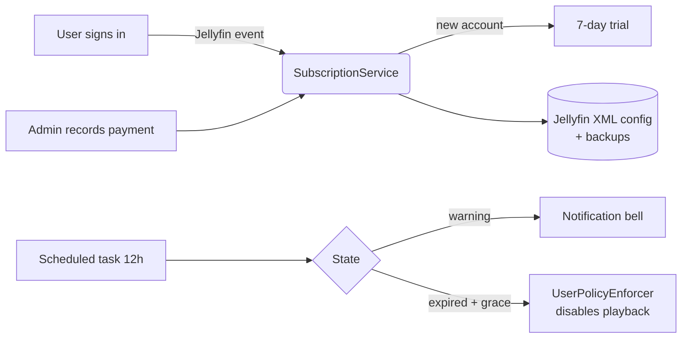

<div align="center">

# 💳 NoPayNoPlay

**Jellyfin plugin for tracking manually-validated monthly subscriptions.**

*No pay, no play — without ever deleting the account.*

[](https://github.com/alexisometric/nopaynoplay/actions/workflows/ci.yml)
[](https://github.com/alexisometric/nopaynoplay/releases/latest)
[](https://jellyfin.org)
[](LICENSE)
[](#-contributing)

</div>

---

## ✨ What is it for?

You self-host Jellyfin for your family / friends / housemates and you'd like them to chip in for the bills — without plugging in Stripe, opening a company and spending Friday nights chasing payments on WhatsApp.

**NoPayNoPlay** automates the tedious parts:

- 📅 keeps track of who owes what and when,
- 🔔 reminds users a few days before expiry via the Jellyfin notification bell,
- 🚫 **disables playback** (but never the account) on expiry,
- ✅ you validate payments manually when the money lands on PayPal / Lydia / your bank account,
- 🆓 free 7-day trial on every new account,
- 🎁 manual exemption for family / VIP guests.

It is designed to be **simple, transparent and reversible**: no external database, no outbound calls, everything lives in Jellyfin's standard XML configuration.

---

## 🌍 Localization

The plugin is **English-first** with a built-in i18n system.

- Translation bundles are embedded JSON resources (`src/Localization/strings.{lang}.json`).
- The active language is resolved from (in order): admin override (`UiCultureOverride` setting) → `?lang=` query → `Accept-Language` header → **Jellyfin server UI culture** → `en` fallback.
- Bundled languages: **English** (`en`), **French** (`fr`).
- Adding a new language is just dropping a new `strings.{code}.json` next to the others and listing it as an `EmbeddedResource` in the csproj.

---

## 🚀 Features

| Admin side | User side |
|---|---|
| Configuration page integrated into Jellyfin | 💳 button in the header with payment modal |
| Color-coded dashboard (green / orange / red / grey) | Banner on warning / grace / blocked |
| "Record payment" button + transaction log | Clickable PayPal.me / Lydia links |
| "Exempt" / "Reset trial" buttons | One-click IBAN copy |
| Scheduled task every 12 h | Jellyfin notification bell entries |
| Auto config backup (retention 10) | Account never deleted, only playback disabled |
| Configurable price, currency, grace period, trial days | Anniversary day preserved across renewals |

> ℹ️ Administrators are **always** automatically exempt.

---

## 📦 Installation (recommended)

### 1. Add the repository in Jellyfin

**Dashboard → Plugins → Repositories → ➕**

| Field | Value |
|---|---|
| **Name** | `NoPayNoPlay` |
| **URL** | `https://raw.githubusercontent.com/alexisometric/nopaynoplay/main/manifest.json` |

### 2. Install the plugin

**Catalog → NoPayNoPlay → Install**, then restart Jellyfin.

### 3. (Recommended) Install the companion plugin

The user-facing UI (header button, banner, modal) is injected through [**File Transformation**](https://github.com/IAmParadox27/jellyfin-plugin-file-transformation) — the official mechanism to safely modify `index.html`. Without it, the plugin still works but the user UI does not appear.

### 4. Configure

**Dashboard → Plugins → NoPayNoPlay**:

- monthly price, currency, grace days, trial days, warning days;
- PayPal.me, Lydia and IBAN links, free-form note;
- per-user view with quick actions.

---

## 🧠 How it works



- **No external database.** Everything is serialized in the Jellyfin plugin XML configuration.
- **Reversible.** Before blocking a user, their `UserPolicy` is snapshotted. Removing the block restores it as-is.
- **Anti-spam.** A notification is only sent once per state change.

---

## 🔌 REST API

All routes live under `/NoPayNoPlay/`. Admin routes require `RequiresElevation`.

| Method | URL | Auth | Description |
|---|---|---|---|
| `GET`  | `/NoPayNoPlay/Me` | user | Current user state, payment info and translation bundle |
| `GET`  | `/NoPayNoPlay/Strings` | public | Active language + translation bundle |
| `GET`  | `/NoPayNoPlay/Users` | admin | Enriched subscription list |
| `POST` | `/NoPayNoPlay/Users/{id}/Pay` | admin | Records a payment, extends expiry |
| `POST` | `/NoPayNoPlay/Users/{id}/Exempt` | admin | Toggle exemption |
| `POST` | `/NoPayNoPlay/Users/{id}/Reset` | admin | Reset to a fresh trial |
| `GET`  | `/NoPayNoPlay/Settings` | admin | Global settings |
| `POST` | `/NoPayNoPlay/Settings` | admin | Update settings |
| `GET`  | `/NoPayNoPlay/Web/client.js` | public | Injected client script |

---

## 🛠️ Development

### Prerequisites

- .NET SDK **9.0+**
- Jellyfin Server 10.11.x for local testing (Docker or native)

### Build

```bash
git clone https://github.com/alexisometric/nopaynoplay.git
cd nopaynoplay
dotnet restore
dotnet build src/Jellyfin.Plugin.NoPayNoPlay.csproj -c Release
```

Output DLL: `src/bin/Release/net9.0/Jellyfin.Plugin.NoPayNoPlay.dll`

### Tests

```bash
dotnet test tests/Jellyfin.Plugin.NoPayNoPlay.Tests.csproj
```

### Local packaging (Jellyfin zip)

```bash
./scripts/build.sh 1.0.0.0
# -> artifacts/nopaynoplay_1.0.0.0.zip + .md5
```

### Structure

```
src/
  ├─ Plugin.cs                   # BasePlugin<PluginConfiguration> entry point
  ├─ PluginEntryPoint.cs         # File Transformation hook (reflection)
  ├─ AuthenticationConsumer.cs   # IEventConsumer<AuthenticationResultEventArgs>
  ├─ Configuration/              # PluginConfiguration, UserSubscription, ...
  ├─ Localization/               # Localizer + strings.{lang}.json bundles
  ├─ Services/                   # SubscriptionService, UserPolicyEnforcer
  ├─ Api/                        # REST controllers
  ├─ ScheduledTasks/             # EnforcementTask (12h)
  └─ Web/                        # client.js, config.html, transformer
tests/                           # xUnit
scripts/                         # build.sh, update-manifest.sh
.github/workflows/               # ci.yml, release.yml
```

---

##  Reporting bugs / feature requests

Before opening an issue, please check it doesn't already exist in [Issues](https://github.com/alexisometric/nopaynoplay/issues).

| Type | Link |
|---|---|
| 🐞 Bug | [Open a bug](https://github.com/alexisometric/nopaynoplay/issues/new?labels=bug&template=bug_report.yml) |
| 💡 Feature | [Suggest an enhancement](https://github.com/alexisometric/nopaynoplay/issues/new?labels=enhancement&template=feature_request.yml) |
| ❓ Question | [Start a discussion](https://github.com/alexisometric/nopaynoplay/discussions) |

For a bug, please include:

- Jellyfin and NoPayNoPlay versions,
- relevant log (`<jellyfin-data>/log/jellyfin*.log`),
- steps to reproduce.

---

## 🤝 Contributing

Contributions are very welcome! Standard workflow:

1. Fork the repo
2. Create a branch: `git checkout -b feat/my-cool-idea`
3. Commit with [Conventional Commits](https://www.conventionalcommits.org/) messages: `feat:`, `fix:`, `docs:`, `chore:`, `test:`...
4. Make sure `dotnet test` passes
5. Open a Pull Request against `main` describing what changes and why

Beginner-friendly tasks live under the [`good first issue`](https://github.com/alexisometric/nopaynoplay/labels/good%20first%20issue) label.

### Style

- C#: Microsoft conventions (4 spaces, `PascalCase`, `var` when the type is obvious)
- JS / HTML / JSON / YAML: 2 spaces
- Any new business logic must be covered by an xUnit test
- All new user-facing strings must go through the `Localizer` (English bundle is the source of truth)

See also [CONTRIBUTING.md](CONTRIBUTING.md) and [CODE_OF_CONDUCT.md](CODE_OF_CONDUCT.md).

---

## ❓ FAQ

<details>
<summary><b>Does the plugin delete accounts?</b></summary>

No. Never. On expiry, only the playback permissions (`EnableMediaPlayback`, transcoding…) are set to `false`. The original policy is snapshotted and restored when the user is unblocked.
</details>

<details>
<summary><b>What happens if I uninstall the plugin while a user is blocked?</b></summary>

Their `UserPolicy` stays in the modified state. **Make sure to unblock everyone before uninstalling** (Reset or Exempt button).
</details>

<details>
<summary><b>What if the server is offline for several days?</b></summary>

The scheduled task runs every 12 h; on next startup it catches up. No data is lost.
</details>

<details>
<summary><b>Can I change the price without breaking active subscriptions?</b></summary>

Yes. The price is read at the time a payment is recorded. Already-computed expiries do not move.
</details>

<details>
<summary><b>Is it compatible with Jellyfin 10.10?</b></summary>

No, the API has changed. This release targets Jellyfin **10.11.x** (`targetAbi` 10.11.8.0).
</details>

---

## 📜 Data storage

| Data | Location |
|---|---|
| Plugin configuration | `<jellyfin-data>/plugins/configurations/f3b4d2c1-7e9a-4b1e-9c6d-9a1b2c3d4e5f.xml` |
| Backups | `<jellyfin-data>/plugins/configurations/NoPayNoPlay.backups/` |
| Logs | standard Jellyfin logs |

**No outbound calls.** **No telemetry.** Everything stays on your server.

---

## 🛡️ Security

If you find a vulnerability, **please do not open a public issue**. See [SECURITY.md](SECURITY.md) for the responsible disclosure procedure.

---

## 📄 License

[MIT](LICENSE) © alexisometric

---

<div align="center">

If this plugin saves you time, drop a ⭐ on the repo — it really helps!

</div>
