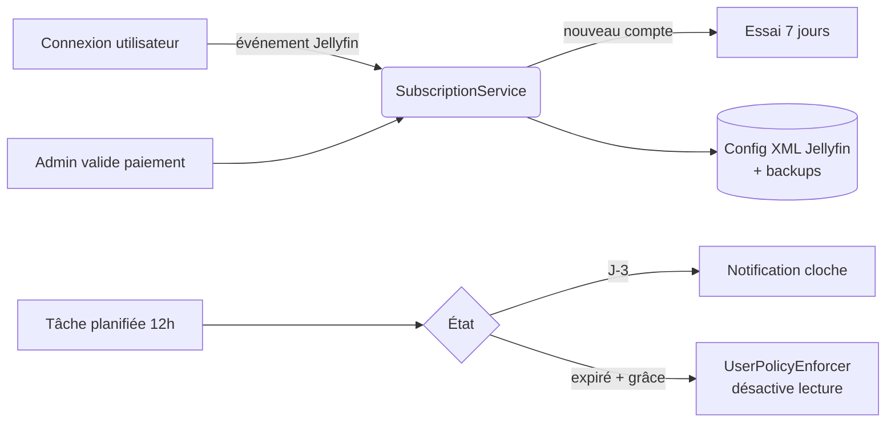

<div align="center">

# 💳 NoPayNoPlay

**Plugin Jellyfin de suivi d'abonnement mensuel à validation manuelle.**

*Pas de paiement, pas de lecture — mais sans jamais supprimer le compte.*

[](https://github.com/alexisometric/nopaynoplay/actions/workflows/ci.yml)
[](https://github.com/alexisometric/nopaynoplay/releases/latest)
[](https://jellyfin.org)
[](LICENSE)
[](#-contribuer)

</div>

---

## ✨ À quoi ça sert ?

Tu héberges un Jellyfin pour ta famille / tes potes / ta colocation et tu voudrais qu'ils participent aux frais — sans pour autant brancher Stripe, ouvrir une SAS et perdre tes vendredis soirs en relances WhatsApp.

**NoPayNoPlay** automatise la partie chiante :

- 📅 il sait qui doit combien et quand,
- 🔔 il prévient à J-3 dans la cloche Jellyfin,
- 🚫 il **bloque la lecture** (mais pas le compte) à expiration,
- ✅ tu valides les paiements à la main quand l'argent arrive sur ton PayPal / Lydia / RIB,
- 🆓 essai de 7 jours offert à chaque nouveau compte,
- 🎁 exemption manuelle pour la famille / les invités VIP.

C'est conçu pour être **simple, lisible et réversible** : aucune base externe, aucun appel sortant, tout vit dans la config XML standard de Jellyfin.

---

## 🚀 Fonctionnalités

| Côté admin | Côté utilisateur |
|---|---|
| Page de configuration intégrée à Jellyfin | Bouton 💳 dans le header avec modal de paiement |
| Tableau de bord coloré (vert / orange / rouge / gris) | Bannière à J-3, en grâce, et bloqué |
| Bouton « Valider paiement » + journal des transactions | Liens cliquables PayPal.me / Lydia |
| Bouton « Exempter » / « Reset essai » | Copie en un clic du RIB |
| Tâche planifiée toutes les 12 h | Notifications cloche Jellyfin |
| Backup auto de la config (rétention 10) | Compte jamais supprimé, juste lecture désactivée |
| Tarif, devise, délai de grâce, jours d'essai configurables | Date anniversaire respectée à chaque renouvellement |

> ℹ️ Les administrateurs sont **toujours** exemptés automatiquement.

---

## 📦 Installation (recommandée)

### 1. Ajouter le dépôt dans Jellyfin

**Tableau de bord → Plugins → Dépôts → ➕**

| Champ | Valeur |
|---|---|
| **Nom** | `NoPayNoPlay` |
| **URL** | `https://raw.githubusercontent.com/alexisometric/nopaynoplay/main/manifest.json` |

### 2. Installer le plugin

**Catalogue → NoPayNoPlay → Installer** puis redémarrer Jellyfin.

### 3. (Recommandé) Installer le plugin compagnon

L'UI utilisateur (bouton header, bannière, modal) est injectée via [**File Transformation**](https://github.com/IAmParadox27/jellyfin-plugin-file-transformation) — c'est le mécanisme officiel pour modifier `index.html` proprement. Sans lui, le plugin fonctionne mais l'UI n'apparaît pas.

### 4. Configurer

**Tableau de bord → Plugins → NoPayNoPlay** :

- tarif mensuel, devise, jours de grâce, jours d'essai, J- de notification ;
- liens PayPal.me, Lydia, IBAN, note libre ;
- vue par utilisateur avec actions rapides.

---

## 🖼️ Aperçu

> _Captures à venir — n'hésite pas à [ouvrir une issue](https://github.com/alexisometric/nopaynoplay/issues/new) avec tes propres screenshots !_

```
┌──────────────────────────────────────────────────┐
│  Jellyfin   🏠 Films Séries  ...           💳 🔔 │
└──────────────────────────────────────────────────┘
       ┌──────────────────────────────────────┐
       │  Abonnement actif jusqu'au 12/06/26  │
       │  Tarif : 10 €/mois                   │
       │  [PayPal]  [Lydia]  [Copier IBAN]    │
       └──────────────────────────────────────┘
```

---

## 🧠 Comment ça marche



- **Aucune base de données externe.** Tout est sérialisé dans le XML de config Jellyfin.
- **Réversible.** Avant de bloquer un utilisateur, sa `UserPolicy` est snapshotée. Lever le blocage la restaure à l'identique.
- **Anti-rebond.** Une notification n'est envoyée qu'une fois par changement d'état.

---

## 🔌 API REST

Toutes les routes sont sous `/NoPayNoPlay/`. Les routes admin nécessitent `RequiresElevation`.

| Méthode | URL | Auth | Description |
|---|---|---|---|
| `GET`  | `/NoPayNoPlay/Me` | user | État + infos de paiement de l'utilisateur courant |
| `GET`  | `/NoPayNoPlay/Users` | admin | Liste enrichie des souscriptions |
| `POST` | `/NoPayNoPlay/Users/{id}/Pay` | admin | Enregistre un paiement, étend l'échéance |
| `POST` | `/NoPayNoPlay/Users/{id}/Exempt` | admin | Active / retire l'exemption |
| `POST` | `/NoPayNoPlay/Users/{id}/Reset` | admin | Réinitialise à un essai |
| `GET`  | `/NoPayNoPlay/Settings` | admin | Paramètres globaux |
| `POST` | `/NoPayNoPlay/Settings` | admin | Mise à jour des paramètres |
| `GET`  | `/NoPayNoPlay/Web/client.js` | public | Script client injecté |

---

## 🛠️ Développement

### Prérequis

- .NET SDK **9.0+**
- Jellyfin Server 10.11.x pour tester localement (Docker ou natif)

### Build

```bash
git clone https://github.com/alexisometric/nopaynoplay.git
cd nopaynoplay
dotnet restore
dotnet build src/Jellyfin.Plugin.NoPayNoPlay.csproj -c Release
```

DLL produite : `src/bin/Release/net9.0/Jellyfin.Plugin.NoPayNoPlay.dll`

### Tests

```bash
dotnet test tests/Jellyfin.Plugin.NoPayNoPlay.Tests.csproj
```

### Empaquetage local (zip Jellyfin)

```bash
./scripts/build.sh 1.0.0.0
# -> artifacts/nopaynoplay_1.0.0.0.zip + .md5
```

### Structure

```
src/
  ├─ Plugin.cs                   # Entrée BasePlugin<PluginConfiguration>
  ├─ PluginEntryPoint.cs         # Hook File Transformation (réflexion)
  ├─ AuthenticationConsumer.cs   # IEventConsumer<AuthenticationResultEventArgs>
  ├─ Configuration/              # PluginConfiguration, UserSubscription, ...
  ├─ Services/                   # SubscriptionService, UserPolicyEnforcer
  ├─ Api/                        # Controllers REST
  ├─ ScheduledTasks/             # EnforcementTask (12h)
  └─ Web/                        # client.js, config.html, transformer
tests/                           # xUnit
scripts/                         # build.sh, update-manifest.sh
.github/workflows/               # ci.yml, release.yml
```

---

## 🚢 Publier une nouvelle version

```bash
# 1. bumper la version dans src/Jellyfin.Plugin.NoPayNoPlay.csproj et src/meta.json
git commit -am "chore: bump 1.0.1.0"

# 2. taguer
git tag v1.0.1.0
git push origin v1.0.1.0
```

Le workflow [`release.yml`](.github/workflows/release.yml) prend le relais :

1. ✅ exécute les tests
2. 📦 build + zip
3. 🚀 crée la GitHub Release avec l'asset
4. 📝 met à jour `manifest.json` (URL + checksum md5 + timestamp) et le commit sur `main`

Jellyfin rafraîchit le catalogue toutes les heures (ou via le bouton ↻ du dépôt) et propose la mise à jour.

---

## 🐛 Signaler un bug / demander une fonctionnalité

Avant d'ouvrir une issue, vérifie qu'elle n'existe pas déjà dans [Issues](https://github.com/alexisometric/nopaynoplay/issues).

| Type | Lien |
|---|---|
| 🐞 Bug | [Ouvrir un bug](https://github.com/alexisometric/nopaynoplay/issues/new?labels=bug&template=bug_report.yml) |
| 💡 Feature | [Proposer une amélioration](https://github.com/alexisometric/nopaynoplay/issues/new?labels=enhancement&template=feature_request.yml) |
| ❓ Question | [Démarrer une discussion](https://github.com/alexisometric/nopaynoplay/discussions) |

Pour un bug, merci de fournir :

- version de Jellyfin et de NoPayNoPlay,
- log pertinent (`<jellyfin-data>/log/jellyfin*.log`),
- étapes pour reproduire.

---

## 🤝 Contribuer

Les contributions sont les bienvenues ! Le workflow standard :

1. Fork le repo
2. Crée une branche : `git checkout -b feat/ma-super-idee`
3. Commit avec des messages [Conventional Commits](https://www.conventionalcommits.org/) : `feat:`, `fix:`, `docs:`, `chore:`, `test:`...
4. Vérifie que `dotnet test` passe
5. Ouvre une Pull Request vers `main` en décrivant ce que ça change et pourquoi

Idées d'amélioration accessibles aux nouveaux contributeurs : voir le label [`good first issue`](https://github.com/alexisometric/nopaynoplay/labels/good%20first%20issue).

### Style

- C# : conventions Microsoft (4 espaces, `PascalCase`, `var` quand le type est évident)
- JS / HTML / JSON / YAML : 2 espaces
- Toute nouvelle logique métier doit être couverte par un test xUnit

Voir aussi [CONTRIBUTING.md](CONTRIBUTING.md) et [CODE_OF_CONDUCT.md](CODE_OF_CONDUCT.md).

---

## 🗺️ Roadmap

- [ ] Captures d'écran officielles dans le README
- [ ] Internationalisation (FR / EN au minimum)
- [ ] Webhook entrant pour valider automatiquement un paiement (PayPal IPN, etc.)
- [ ] Export CSV des transactions
- [ ] Intégration Stripe / paiement automatique optionnel
- [ ] Pack de tests d'intégration avec un Jellyfin éphémère
- [ ] Rappels par e-mail / Discord / ntfy

Vote / suggère sur les [Discussions](https://github.com/alexisometric/nopaynoplay/discussions).

---

## ❓ FAQ

<details>
<summary><b>Le plugin supprime-t-il les comptes ?</b></summary>

Non. Jamais. À l'expiration, seules les permissions de lecture (`EnableMediaPlayback`, transcoding...) sont mises à `false`. La policy d'origine est snapshotée et restaurée au déblocage.
</details>

<details>
<summary><b>Que se passe-t-il si je désinstalle le plugin alors qu'un utilisateur est bloqué ?</b></summary>

Sa `UserPolicy` reste dans l'état où elle a été modifiée. **Pense à débloquer tout le monde avant de désinstaller** (bouton « Reset » ou « Exempter »).
</details>

<details>
<summary><b>Et si le serveur est éteint pendant plusieurs jours ?</b></summary>

La tâche planifiée tourne toutes les 12 h ; au prochain démarrage elle rattrape les états. Aucune donnée n'est perdue.
</details>

<details>
<summary><b>Puis-je modifier le tarif sans casser les abonnements en cours ?</b></summary>

Oui. Le tarif est utilisé au moment de l'enregistrement d'un paiement. Les échéances déjà calculées ne bougent pas.
</details>

<details>
<summary><b>Compatible avec Jellyfin 10.10 ?</b></summary>

Non, l'API a changé. Cette version cible Jellyfin **10.11.x** (`targetAbi` 10.11.8.0).
</details>

---

## 📜 Stockage des données

| Donnée | Emplacement |
|---|---|
| Configuration plugin | `<jellyfin-data>/plugins/configurations/f3b4d2c1-7e9a-4b1e-9c6d-9a1b2c3d4e5f.xml` |
| Backups | `<jellyfin-data>/plugins/configurations/NoPayNoPlay.backups/` |
| Logs | logs Jellyfin standards |

**Aucun appel sortant.** **Aucune télémétrie.** Tout reste sur ton serveur.

---

## 🛡️ Sécurité

Si tu trouves une vulnérabilité, **n'ouvre pas d'issue publique**. Voir [SECURITY.md](SECURITY.md) pour la procédure de divulgation responsable.

---

## 📄 Licence

[MIT](LICENSE) © alexis

---

<div align="center">

Si ce plugin t'a fait gagner du temps, laisse une ⭐ sur le repo, ça motive !

</div>
