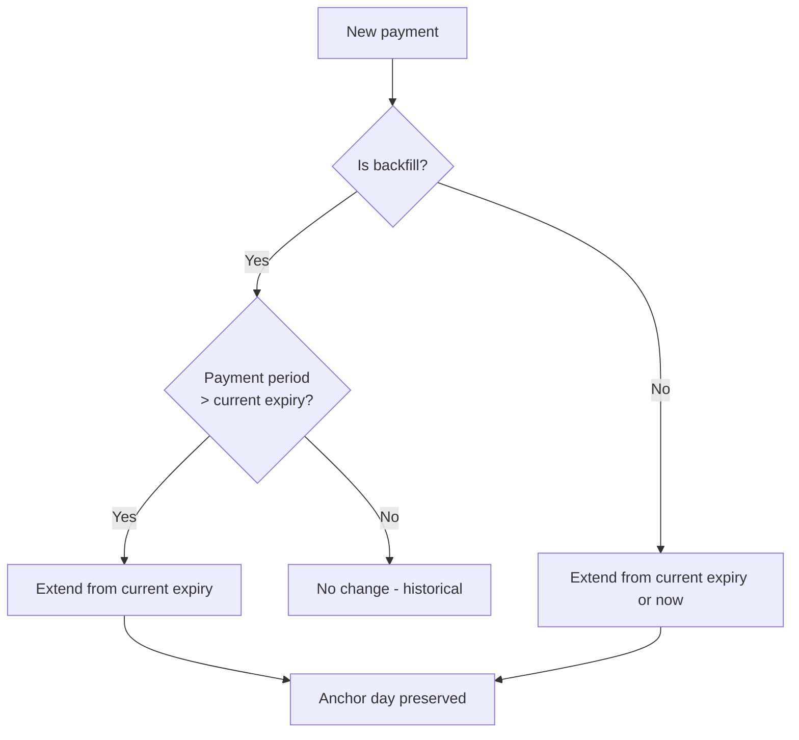

# 🏗️ Architecture Overview

## High-level flow

```mermaid
flowchart LR
    A[User signs in] -->|AuthenticationResult event| B(AuthenticationConsumer)
    B -->|calls| C{SubscriptionService}
    C -->|new user| D[7-day trial created]
    C -->|existing user| E[Return current state]
    
    F[Scheduled task<br/>every 12h] -->|EnforcementTask| G{SubscriptionService<br/>evaluate states}
    G -->|warning| H[Notification bell]
    G -->|grace expired| I[UserPolicyEnforcer]
    I -->|Snapshot + block| J[Playback disabled]
    
    K[Admin records<br/>payment] --> C
    L[User clicks<br/>"I just paid"] -->|POST /Me/MarkPaid| M[Pending claim]
    M -->|Admin confirms| C
    N[User redeems<br/>promo code] -->|POST /Me/RedeemCode| C
    
    C --> O[(Jellyfin XML config)]
    O -->|Auto-backup| P[config/backups/]
```

---

## Project Structure

```
src/
├── Plugin.cs                         # BasePlugin entry point
│   ├── Instance singleton             # Global access point
│   ├── SeedDefaultsAndDedupe()        # First-run defaults + fix duplicates
│   └── SaveConfiguration()            # Persist + auto-backup
│
├── PluginEntryPoint.cs               # IHostedService
│   ├── Retry loop (3s→180s back-off)  # FT registration retries
│   └── Diagnostics tracking           # Runtime diagnostics
│
├── AuthenticationConsumer.cs         # IEventConsumer<AuthenticationResultEventArgs>
│   └── Tracks users on sign-in        # Creates subscription if new
│
├── PluginServiceRegistrator.cs       # IPluginServiceRegistrator
│   └── DI registration                # Singleton services
│
├── Configuration/
│   ├── PluginConfiguration.cs        # XML-persisted settings
│   ├── UserSubscription.cs           # Per-user subscription data
│   ├── SubscriptionTier.cs           # Plan definition
│   ├── PromoCode.cs                  # Promo/referral code
│   ├── TransactionEntry.cs           # Payment record
│   ├── AuditLogEntry.cs             # Admin action log
│   └── UserTag.cs                   # Member group definition
│
├── Services/
│   ├── SubscriptionService.cs        # Core business logic
│   │   ├── MutateConfig()            # Thread-safe mutations
│   │   ├── ComputeNextExpiry()       # Date anchoring logic
│   │   ├── EvaluateState()           # State machine (Ok→Warning→Grace→Blocked)
│   │   └── RedeemPromoCode()         # Promo validation
│   │
│   ├── UserPolicyEnforcer.cs         # Playback block/restore
│   │   ├── BlockAsync()              # Save snapshot + disable playback
│   │   └── RestoreAsync()            # Restore from snapshot
│   │
│   └── RateLimiter.cs                # In-memory rate limiter
│       ├── CheckAsync()              # Per-key rate check
│       └── Failure tracking           # Brute-force protection
│
├── Api/
│   ├── NoPayNoPlayController.cs      # REST API controller
│   │   ├── Admin endpoints            # Requires elevation
│   │   └── User endpoints             # Authenticated users
│   │
│   └── ClientAssetsController.cs     # Static file serving
│       ├── /Web/client.js             # User UI script
│       └── /Web/qrcode.js             # QR code generator
│
├── ScheduledTasks/
│   └── EnforcementTask.cs            # IScheduledTask (12h interval)
│       ├── State evaluation           # Check all subscriptions
│       ├── Policy enforcement         # Block/restore users
│       ├── Notification dispatch      # Bell notifications with dedup
│       └── Orphan cleanup             # Remove stale subscriptions
│
├── Localization/
│   ├── Localizer.cs                  # i18n engine
│   │   ├── GetBundle()               # Culture-resolved translations
│   │   └── Merge()                   # Fallback chain
│   │
│   └── strings.{lang}.json           # 8 language bundles
│       ├── en, fr, es, de            # English, French, Spanish, German
│       └── it, pt, ru, zh            # Italian, Portuguese, Russian, Chinese
│
└── Web/
    ├── client.js                     # Injected user UI
    │   ├── Header button              # 💳 icon
    │   ├── Banner                     # Sticky notification bar
    │   ├── Modal                      # Subscription management
    │   ├── Toast system               # Feedback notifications
    │   └── Test mode                  # ?npnpTest=STATE preview
    │
    ├── config.html                   # Admin dashboard
    │   └── config.js                 # Dashboard logic
    │
    ├── qrcode.js                     # Vendored QR generator
    │
    └── WebTransformer.cs             # File Transformation callback
        └── TransformAsync()           # Inject <script> into index.html
```

---

## Key Design Decisions

### No External Database

Everything is stored in Jellyfin's XML plugin configuration. This means:
- ✅ No SQLite, PostgreSQL, or other database setup
- ✅ Full compatibility with Jellyfin's backup/restore
- ✅ Configuration is human-readable XML
- ❌ Not suitable for thousands of users (XML performance degrades beyond ~500)

### Thread Safety

`SubscriptionService.MutateConfig()` uses a **static lock** to protect all config mutations:

```csharp
lock (_lock)
{
    if (mutator(Config))
    {
        _save();
    }
}
```

This prevents races between:
- The scheduled task (running every 12h)
- Admin API endpoints
- Self-service endpoints (`/Me/MarkPaid`, `/Me/RedeemCode`)

### Expiry Date Computation

`ComputeNextExpiry()` uses an **anchor-day preservation** strategy:

1. **Regular payments** extend from current expiry (or now if lapsed)
2. **Backfilled payments** (past dates) only extend if the payment period reaches beyond current expiry
3. **End-of-month** is handled correctly (Jan 31 + 1 month = Feb 28/29)



### Subscription State Machine

```
Ok ──(warning window)──→ WarningSoon ──(expiry)──→ InGrace ──(grace expired)──→ Blocked
│                                                                                    │
└───────────────────── Payment received ─────────────────────────────────────────────┘
```

Plus:
- **Exempt** — orthogonal state, never blocked
- **Administrators** — always exempt automatically

### UserPolicy Enforcement

Before blocking a user, a **snapshot** saves the current playback permissions:

```json
{
  "enableMediaPlayback": false,
  "enableAudioPlaybackTranscoding": false,
  "enableVideoPlaybackTranscoding": false,
  "enablePlaybackRemuxing": false
}
```

On restore, **only flags matching the snapshot** are reverted — preserving any admin changes made during the block period.

Active sessions are stopped immediately via `SendPlaystateCommand(Stop)`.

### File Transformation (JS Injection)

The `WebTransformer` class registers a callback with the File Transformation plugin:

1. Looks for `index.html` in the transformable files
2. Only modifies payloads that look like HTML documents (`<!doctype html` or `<html` start) — avoids corrupting Webpack JS chunks
3. Injects `<script defer src="/NoPayNoPlay/Web/client.js?v=VERSION">` before `</body>`
4. Strips previously injected scripts (cache-busting on update)
5. Retries with back-off (3s→180s) if FT assembly isn't loaded yet

### Anti-spam & Rate Limiting

| Mechanism | Scope | Details |
|---|---|---|
| Notification dedup | Per-user, per-milestone | `LastNotificationKey` = `state:milestone` |
| "I just paid" | Per-user, 30 min | In-memory timestamp, resets on restart |
| Promo brute-force | Per-IP, threshold-based | Lockout after N failed attempts |

### i18n System

Culture resolution chain:
1. Admin override (`UiCultureOverride` setting)
2. `?lang=` query parameter
3. `Accept-Language` HTTP header
4. Jellyfin server UI culture
5. `en` fallback

Plural support: `key.one` / `key.other` suffixes. Token substitution via `{token}` placeholders.
